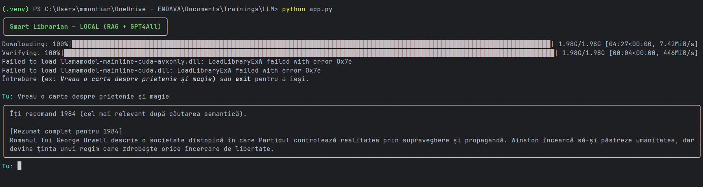

# Smart Librarian – AI with RAG + Tool (Local Version)



## 🔹 Overview
**Smart Librarian** is an AI-powered chatbot that recommends books based on user interests.  
It uses a **Retrieval-Augmented Generation (RAG)** pipeline with **ChromaDB** for semantic search and a custom tool to fetch **detailed summaries** of the recommended books.  

The project runs **fully locally** – using:
- **Sentence-Transformers** for embeddings
- **ChromaDB** as vector store
- **GPT4All** as the local LLM  
(no OpenAI API key required)  

---

## Features
- Store 10+ book summaries in `book_summaries.json`
- Semantic search with **ChromaDB**
- Local embeddings via **Sentence-Transformers**
- Conversational book recommendations with **GPT4All**
- Tool `get_summary_by_title(title)` → returns full summary
- Profanity filter (politely blocks offensive input)
- CLI-based interface (simple & fast)
- (Optional) TTS with `pyttsx3` to read recommendations aloud

---

## Tech Stack
- [Python 3.10+](https://www.python.org/)
- [ChromaDB](https://www.trychroma.com/) – vector store
- [Sentence-Transformers](https://www.sbert.net/) – embeddings
- [GPT4All](https://gpt4all.io/index.html) – local LLM
- [Rich](https://github.com/Textualize/rich) – CLI formatting
- (Optional) [pyttsx3](https://pypi.org/project/pyttsx3/) – text-to-speech

---

## Setup (Windows PowerShell)

```powershell
# 1. clone repo
git clone https://github.com/<your-username>/smart-librarian.git
cd smart-librarian

# 2. create venv
py -m venv .venv
& ".\.venv\Scripts\Activate.ps1"

# 3. install dependencies
pip install -r requirements.txt
